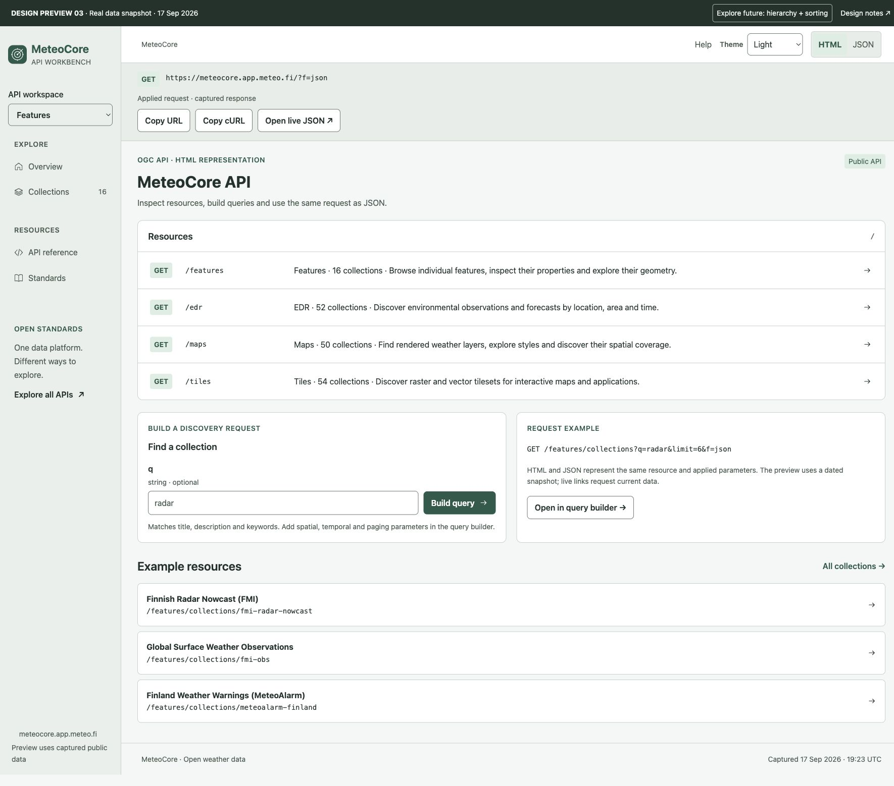

# MeteoCore API workbench — design proposal 03

**Status: design for approval. Production HTML, routes and handlers are unchanged.**

[Open the running local prototype](http://127.0.0.1:8766/) or open `index.html`
directly in a browser. The prototype is dependency-free and works offline.
To start it again:

```sh
python3 -m http.server 8766 --bind 127.0.0.1 --directory docs/design/api-explorer
```

## Screenshots



[Query builder · light](screenshots/collections.png) ·
[Query builder · dark](screenshots/collections-dark.png) ·
[JSON representation](screenshots/json.png) ·
[Items and map](screenshots/items.png) ·
[Item detail](screenshots/item-detail.png) ·
[Future hierarchy](screenshots/hierarchy.png) ·
[Mobile collections](screenshots/mobile-collections.png)

## The proposed experience

An HTML representation of the API, organized around resources and requests.
The landing page is an endpoint index. Collection discovery puts a parameter
editor beside results, with exact parameter names, types, paging inputs and an
encoded request preview. Collection and item pages retain readable metadata,
geometry and typed properties within the same request-oriented shell.

Primary journey:

**API resource → collection query → collection → item query → item → HTML / JSON.**

The same shell serves EDR, Maps, Tiles and Features. Common navigation and
collection discovery are shared; data access changes according to the API and
collection capabilities. The current mockup builds collection queries and
Features item equality/time queries. Complete EDR geometry, Maps rendering and
Tiles request builders remain separate design increments; their advertised
access methods are linked from collection details.

### Representation and request controls

- **HTML / JSON** remains visible in a sticky top bar, including on mobile.
  It changes the representation of the current resource with the same applied
  filters, limit and offset. JSON is a full page, not a modal.
- The request panel shows the machine-readable counterpart of the applied
  request, with **Copy URL**, **Copy cURL** and **Open live JSON**. The last
  action opens the real service in another tab; its data may have changed.
- The prototype's JSON view displays captured or locally simulated data and
  labels that distinction. Landing/reference/future resources are conceptual;
  production must serialize the actual same resource behind both formats.
- Editing parameters updates the **Request preview** without changing results
  or the applied JSON link. **Apply query** commits the parameters. Changing
  filters resets offset; an explicitly entered offset is respected.
- A single-item API URL contains its item ID, not the previous list's filter
  parameters. The prototype preserves list context separately in navigation.
- Future-only requests expose a concept JSON view but no misleading live link.

### Themes

**System / Light / Dark** is available alongside the representation switch.
System follows the OS; explicit choices persist locally across reloads. Theme
is a presentation preference, so it does not change the API query or results.
Both palettes cover controls, results, JSON/code, dialogs and map context.
Production should apply the preference before first paint to avoid a flash,
while preserving readable defaults without JavaScript.

## Review these flows

1. Open the resource landing page, then **Open in query builder**.
2. Edit `q`, `query`, `bbox`, `datetime`, `limit` and `offset`. Observe the
   draft request separately from the applied request. Try
   `radar +Finland -volume` in `query`, then **Apply query**.
3. Switch **HTML → JSON → HTML**; the same filters and page remain selected.
   Copy the cURL command or follow **Open live JSON**.
4. Open Finnish Radar Nowcast, then **Browse items**. Filter `severity` equals
   `moderate`, switch to JSON, then return and open a single item.
5. Select the map cluster and choose Siikajoki. Inspect typed properties and
   quality flags. Open Finland Weather Warnings to see expiry information.
6. Switch between **Light**, **Dark** and **System**, including on mobile.
7. Use **Review a screen state** for empty/loading/failure designs.
8. Use **Explore future: hierarchy + sorting** for proposed groups, title
   sorting, parent breadcrumbs and discovery-only group pages.

## Screen decisions

| Screen | Main task | Design |
|---|---|---|
| Platform landing | Choose an access method | Endpoint index with GET methods, resource paths, collection counts and query examples. |
| API landing | Understand this API and start exploring | Links to collections, conformance and OpenAPI, with a starter query and example resources. |
| Collections | Find suitable datasets | Parameter editor beside results: q/query, bbox, datetime, limit/offset, draft URL, apply action, result counts and paging. |
| Collection overview | Decide whether the dataset fits | Description, coverage and temporal range, keywords, license, available access methods and other API representations. |
| Items | Inspect a collection's contents | Supported property/time filters, compact table, map and quick-look panel, clear paging and GeoJSON access. |
| Item detail | Read one feature without raw JSON overload | Meaningful title, source ID, geometry, typed property table, optional domain-specific summary, quality flags and validity information. |
| Metadata & links | Inspect the resource contract | Named links and their media types, machine-readable metadata, and full field access. |
| Reference / standards | Connect and assess capabilities | API documentation, OpenAPI, examples and a distinction between implemented capabilities, declared classes and planned drafts. |

The sample landing-page collection choices are editorial examples. Production
must derive available choices from the registry or configured highlights; it
must not hardcode these IDs or assume every deployment contains Finnish data.
The site root currently returns JSON; a new HTML representation would be an
explicit implementation task after approval, preserving the JSON contract.

## Search and navigation contract

- **Basic collection search → `q`.** Words separated by whitespace are a phrase;
  comma-separated alternatives are OR. Scope is title, description and keywords.
- **Advanced collection search → `query`.** Required/excluded terms are exposed
  with a nearby example, not hidden syntax. Encode literal `+` as `%2B`. Support
  is based on PR #743; the captured deployment is not assumed to have it yet.
- **Area → `bbox` in CRS84.** Four labeled numerical inputs are the accessible
  baseline. A later map drawing control may populate them; moving a map must
  not silently change the query.
- **Time → `datetime`.** Explicit UTC input supports an instant or open/closed
  interval. Show the available temporal range where known. Unknown collection
  extents remain eligible according to the existing Common contract.
- All supplied collection filters are ANDed before paging. Search submission,
  removing a chip, changing page size or changing future sort order resets
  offset. Normal paging preserves every filter and the selected representation.
- The production source of truth is the URL, with `f=html` retained in links.
  GET forms and ordinary links should work without JavaScript. JS enhances
  maps, views and request previews. The mockup uses hash routes only to work
  as static files, not as a proposed production routing change.
- A collection detail returns to the originating results and their filters.
  Item detail returns to the filtered item page. Browser Back/Forward work.
- Switching APIs keeps the current collection only when it exists there;
  otherwise return to that API's discovery page with supported filters intact.
  Different catalogs and counts are legitimate, not inconsistent UX.
- **Item filtering is separate.** Do not send Common `q`/`query` to `/items`.
  Only show properties, sorting and query types supported by the active engine.
  Equality filters must say “equals”; do not suggest substring/full-text or
  arbitrary range support. Bbox and datetime support come from the API contract.
- Display unknown counts as unknown, not zero. Follow server next/prev links;
  do not invent a final page when `numberMatched` is unavailable. The numbered
  paging shown here uses known snapshot counts.
- Map/table item views must identify their scope: current page, loaded sample,
  or all matching features. Do not draw a few returned items while implying the
  entire dataset is visible. Production would default to the returned page.
  Nearby points use a cluster picker with names and IDs, so overlapping
  markers cannot silently select the wrong feature.
- Copying an API URL preserves the same query while selecting the machine
  representation. Copying an explorer link preserves `f=html` and page context.

## Future Common extensions

The review toggle demonstrates future capabilities without suggesting that
sorting/hierarchy are already available. Proposed relationships use existing
collection records; the source catalog remains flat.

### Sorting

Reserve the right side of the results toolbar for a labeled sort control,
alongside the local list/cards choice. When collection sorting becomes
available, populate the choices from the sortables resource and expose direction
in the label. Use stable ID tie-breaking, sort before pagination, preserve
`sortby` in links, and reset offset when order changes. Default order must be
explicit. Advanced multi-key sorting can be progressively disclosed rather
than crowding the basic toolbar. Item sorting uses its own advertised engine
capabilities; it must not inherit Common collection sort choices.

### Hierarchy

- Keep flat results as a complete discovery option. Offer an explicit hierarchy
  view rather than hiding child collections by default.
- Group rows have a folder icon and **Group** label, a direct link to group
  details, and a separate expand/collapse control. A group without data access
  never offers Browse items, Map or data-query buttons.
- The group resource has a children view. Filter scope is visible: “All
  collections” or “Within Finnish radar network”. A depth control maps to
  `descendants=immediate/all`, with `parent` preserved through search/paging.
- Child pages include parent breadcrumbs and a parent link; access through a
  flat search must not lose the structural parent relationship.
- Group extent is the server's union of children. Counts distinguish immediate
  children from all descendants. Loading another branch must not imply that
  unloaded branches are empty.
- Search across a hierarchy should show matching descendants with enough parent
  context to identify them. Ancestors included only for navigation must be
  distinguishable from actual matches and must not inflate match counts.
- Radar networks and NWP-model/parameter groups use the same generic pattern.
  A Maps parameter child is a renderable collection; the grouping node is not.
- Proposed parent IDs, heterogeneous child support, API-specific grouping and
  aggregation need the #301 design/implementation. The group in this prototype
  has one level, so immediate/all descendants intentionally produce the same
  result. This is labeled in the UI.

Future `sd`/`resolution` belong in a collapsed **Scale & detail** filter section
once the backend and metadata support them. Use an exclusive mode selector
because they cannot be supplied together. Explain scale and units next to the
inputs. Do not ship inert controls or infer native resolution as a suitability
range. CQL2/queryables can later extend an advanced filter builder without
replacing basic text/area/time discovery.

## Typography and contrast

The prototype now uses one shared type scale and semantic color palette,
replacing the earlier per-component and mobile font reductions.

| Role | Size at the default browser setting | Font |
|---|---|---|
| Body, controls, navigation, table values | 16 px / 1 rem | System UI |
| Help, badges, metadata, breadcrumbs | 14 px / 0.875 rem | System UI |
| URLs, JSON, IDs, property keys | 14 px / 0.875 rem | One shared monospace stack |
| Subheadings / section headings | 18 px / 24 px | System UI, semibold |
| Page headings | 32 px; 24 px on narrow screens | System UI, bold |

Parameter labels and HTML/JSON controls use the UI font. Monospace is reserved
for actual code and identifiers. Browser font-size preferences scale the rem
values. Mobile rearranges and wraps content instead of reducing supporting text.

Light and dark themes share color roles for primary/secondary text, controls,
code, status colors and surfaces. Input placeholders, null values and help text
remain readable. Form/button borders have their own stronger color instead of
reusing subtle panel separators. Native visited-link colors are explicitly
normalized; hover and selected states retain their foreground/background pair.

### Revision 03 measurements

Chrome DOM measurements covered landing, collections (list/cards), collection
metadata, item list/detail, JSON, request failure, future hierarchy, and mobile
HTML/JSON at 390/320 px. The checked text, including placeholders, had:

- **Minimum 14 px computed size**, with 16 px body text and form controls.
- **Minimum measured contrast 5.83:1 in light mode and 6.70:1 in dark mode**
  across the final checked screens, exceeding the 4.5:1 normal-text target.
- Two computed font stacks: system UI and monospace.
- No page-level horizontal overflow in the checked 390/320 px mobile views.

The review used computed foreground and ancestor-composited background colors
with the relative-luminance contrast formula. It excluded disabled controls,
hidden elements and SVG text; map labels were enlarged and visually reviewed.
It is a focused design check, not full accessibility certification. Native
select popups, screen-reader behavior and every possible data/state combination
still require production validation.

## Visual and interaction system

- Light and dark palettes with teal primary actions and distinct workspace,
  panel and code surfaces.
  Status colors supplement text and icons; they never carry meaning alone.
- System UI type uses the shared 14/16/18/24/32 px scale above. Monospace
  is reserved for code, IDs and property keys. Avoid inline font-size overrides
  and do not shrink text to make a layout fit.
- One prominent action per task. HTML and JSON are equal representations;
  method, resource path and parameter names are explicit. Longer raw metadata
  remains available through the JSON view and metadata tabs.
- Shared page shell, breadcrumbs, API picker, forms, chips, result rows,
  pagination, request bar and status messages. API adapters supply capabilities
  and metadata; avoid four separately evolving frontend implementations.
- Feature values keep their types. Null is **Not available**, arrays remain
  arrays, and zero/false are actual values. Long IDs and warning text wrap.
- Domain summaries are optional, capability-driven additions to a generic
  property table. A storm-cell summary should show raw source values and units;
  it must not invent meteorological meaning or hide likely-clutter flags.
- UTC labels are always explicit. Expired warnings are identified from their
  validity interval. A loading failure must not look like “no weather”.
- Empty results retain filters and offer a useful reset. Invalid filters get
  field-level messages. Failure retains the request and offers Retry. Loading
  reserves the results area and announces progress.

## Responsive and accessibility requirements

Desktop uses persistent sidebar navigation, a query editor beside results,
and supplementary data/map context.
Below 800 px, navigation becomes a compact top bar. Below 560 px, filters and
content stack; item tables may scroll horizontally inside their own container,
without making the whole page overflow. Maps are supplementary: all item access,
properties and filter inputs remain usable without a map.

Use semantic landmarks, visible form labels, native controls, keyboard focus
indicators, accessible dialog dismissal, selected-state announcements, a skip
link, and status/validation live regions. Production target is WCAG 2.2 AA,
including contrast, keyboard operation, touch targets and reduced motion.
The prototype is not an accessibility certification. A production implementation
requires keyboard and screen-reader checks in addition to visual validation.

## Data provenance and prototype limits

Public snapshot captured **2026-09-17 19:23:32 UTC** from
`https://meteocore.app.meteo.fi`:

- EDR: 52 collections; Maps: 50; Tiles: 54; Features: 16.
- Nowcast: 8 of 105 items; Finnish warnings: all 5 returned items; observations:
  5 of 7,096 items. IDs, properties, timestamps and geometries come from those
  responses. No fabricated observations or severity values.
- Feature OpenAPI was read to populate supported property names. No fabricated
  item queryables endpoint is assumed.
- `/features/collections` and the equivalent three other API catalogs were
  fetched as JSON, plus `/features`, `/features/api` and the three bounded
  `/features/collections/{id}/items` requests.
- Public-domain Natural Earth 1:110m country outlines from
  [natural-earth-vector](https://github.com/nvkelso/natural-earth-vector/blob/master/geojson/ne_110m_admin_0_countries.geojson).
  The offline map is a simplified Nordic locator, not an operational map or
  a rendered radar product. Geometry outside that view remains available in
  item properties/GeoJSON. Production maps must fit the returned extent.
- `snapshot.js` contains the reusable captured data. `explorer.js` simulates
  discovery against it. No backend traffic occurs when searching or filtering
  inside the prototype. Explicit links labeled live/API docs open the real site.
- Styles, EDR query types and tile matrix sets are real metadata, but rendering
  and data-query builders remain links to existing tools. They are not newly
  implemented in this design exercise.
- The design's standards page describes the intended current source baseline,
  not certification and not a claim about the captured deployment.

## Prototype validation

Checked in connected Chrome:

- Basic and required/excluded collection search; filters carried into return links.
- Item equality filters, filtered detail/back navigation and null property values.
- Overlapping map points: the named picker selects the correct Siikajoki feature.
- Future sorting control, group/depth view and parent breadcrumb navigation.
- Request-failure review state and desktop layouts.
- Mobile catalog at 390 px and 320 px without page-level horizontal overflow;
  mobile item layout at 390 px with contained table scrolling (revision 01);
  revision 02 HTML catalog at 390 px and JSON at 320 px without page overflow.
- Revision 02: encoded draft URL versus applied request, filtered and paged
  HTML/JSON parity, and theme persistence across reloads.

JavaScript syntax, workspace Rust formatting and workspace Clippy checks pass.
These checks cover the prototype, not production integration or complete
accessibility conformance.

## Approval and later implementation

Approve or revise the navigation model, visual direction, search interaction,
collection/item layouts, and the reserved extension points first.

After approval, deliver incrementally:

1. Shared HTML shell, resource landing pages, light/dark/system themes,
   persistent representation links and collection query forms.
2. Collection overview and capability-aware access/navigation.
3. Features item list/detail with progressive map enhancement and typed values.
4. Metadata/reference/conformance pages and complete responsive/accessibility QA.
5. Enable sorting/hierarchy/scale controls only with their actual backend work.

Production work must preserve OGC links, format negotiation, proxy prefixes,
escaping, pagination semantics, API-specific extents and current JSON contracts.
Add meaningful HTML/contract checks alongside the existing shared discovery
suite. Read the root and relevant crate CLAUDE.md files before touching them.
